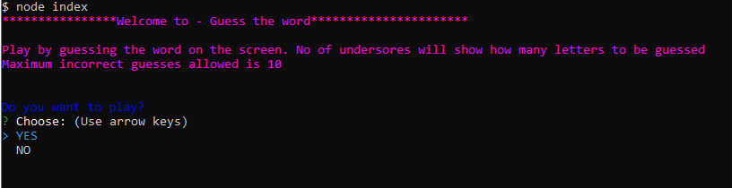
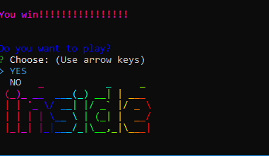
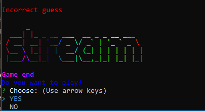
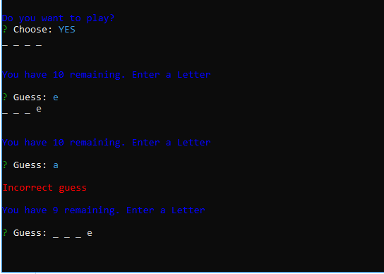

# Constructor-Word-Guess

### Introduction    

A command line word guessing game. Player should guess the letters of a randomly generated word to win.
Guessing should be done within the no of truns allowed

###Instructions
* Open a terminal such as Bash
* Navigate to the folder that contains Constructor Word Guess
* Run the command Node index.js
* Player will be prompted asking "Do you like to play?
* Play "YES" to Play or "NO" quit
* When "YES" is selected a random word would be generated and presented as underscores Eg ._ _ _ _ _ 
* When player enters a letter programm will validate it.
* If the letter is in the word will let the player continue
* If the letter is not in the word a message will be populated as "Incorrect letter"
* Player should guess all the letters to Win. 
* Only 10 incorrect guesses are allowed.

### Technologies
* JavaScript
* Nodejs
* Node Module packages
    * random-words
    * inquirer
    * chalk
    * gradient-string
    * figlet

* Git
* GitHub

### Screenshots

**Start Game**

**Game Won**

**Game Loose**

**Game in progress**

**Developed and maintained by Indima Dias. 06/06/2019